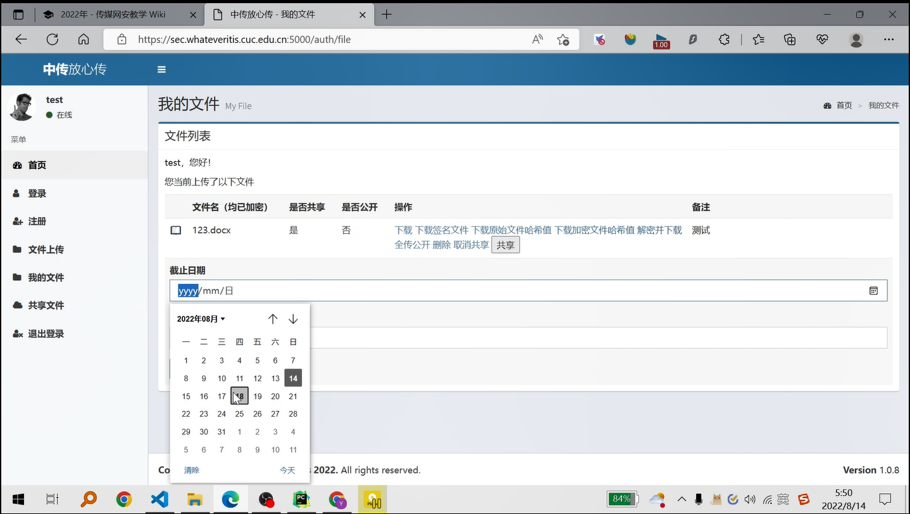
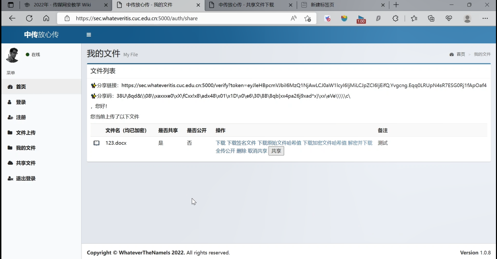
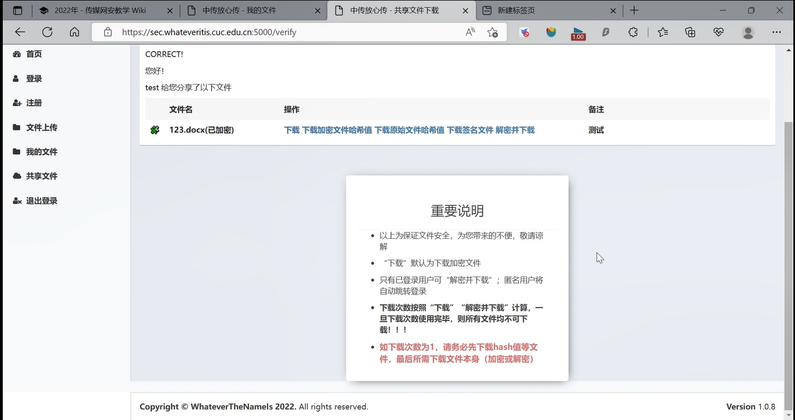

# 中传放心传

本项目是基于密码学基础实现用户文件分享以及满足分享过程中多层次需求的网页工程

## 功能清单

本项目实现的功能有：

* 基于网页的用户注册与登录系统
    
    * 允许用户注册到系统
        
        * 用户名强制要求为电子邮件地址
        * 用户口令长度限制在36个字符之内
        * 对用户输入的口令进行强度校验，禁止使用弱口令
    
    * 使用合法用户名和口令登录系统
    * 禁止使用明文存储用户口令
        
        * 存储的口令即使被公开，也无法还原/解码出原始明文口令
        * 利用邮箱的双因素认证
    
    * 安全的忘记口令 / 找回密码功能

* 基于网页的文件上传加密与数字签名系统
    
    * 已完成《基于网页的用户注册与登录系统》所有要求
    * 限制文件大小：< 10MB
    * 限制文件类型：office文档
    * 匿名用户禁止上传文件
    * 对文件进行对称加密存储到文件系统，禁止明文存储文件
    * 文件秒传：服务器上已有的文件，客户端禁止重复上传
    * 用户可以浏览自己上传的所有文件
    * **用户可以删除自己上传的文件**
    * 用户选择分享文件
        
        * 设置时间 
        * 设置下载次数
        * 取消共享
    
    * **用户可选择是否公开分享文件**
    * 生成分享码和分享链接

* 基于网页的加密文件下载与解密
    
    * 已完成《基于网页的文件上传加密与数字签名系统》所有要求
    * 公开分享的文件可直接下载（不区分已登录用户和匿名用户）
        
        * 下载原始文件
        * 下载原始文件散列值 
        * 下载加密文件
        * 下载数字签名文件
    
    * 被分享者通过分享链接下载相应文件
        
        * 下载加密文件
        * 下载加密文件散列值 
        * 解密并下载（仅已登录用户可使用）
        * 下载原始文件散列值 （仅已登录用户可使用）
        * 下载签名文件
    
    * 客户端上传文件输入文件分享码可使用功能
        
        * 解密
        * 验证数字签名 
        * 验证文件完整性

    * 提供已登录用户下载自己上传的文件及其相关文件
        
        * 下载原始文件
        * 下载原始文件散列值 
        * 下载加密文件
        * 下载数字签名文件
    
    * 下载URL设置有效期（限制时间和限制下载次数），过期后禁止访问

> 粗体为本小组创新内容

## 本项目用到的关键技术

* 对称加密 
* 对称加密密文的PADDING问题 
* 非对称（公钥）加密
   
    * 使用 RSA 算法，进行非对称（公钥）加密
    * 由于非对称加密的处理速度较慢，适合处理较小文件的特性，在密钥管理时使用该加密算法
    * 由于攻击者无法获得系统私钥，攻击者无法明文获取文件加密所用的加密密钥，数字签名使用的用户私钥

* 密钥管理（安全存储对称加密密钥及用户私钥）
   
    * 采用系统的公钥对对称加密密钥进行加密并存储，需要使用对称加密密钥时再使用系统私钥进行解密
    * 采用系统的公钥对用户私钥进行加密并存储，需要使用用户私钥时再使用系统私钥进行解密

* 消息认证码

    * 使用 HMAC 算法对加密后的文件生成消息认证码
    * HMAC 算法所需的密钥为对称加密过程中使用的种子密钥，这种 ETM 模式具有较强安全性
    * 生成的消息认证码可以用于认证文件的真实性和来源真实性即文件未被篡改且在对称加密密钥未被泄露时保证该文件是由平台加密而成。
    * 由于攻击者无法获得对称加密密钥，所以无法篡改加密文件并生成新的消息认证码以躲过客户端的消息认证码认证

* 数字签名
    
    * 使用用户的私钥对消息认证码进行加密 
    * 使用用户的公钥对数字签名文件进行认证
    * 生成的数字签名文件可以用于认证用户获取的文件确实来源于该文件的上传者
    * 攻击者无法伪造用户私钥，所以无法冒名顶替为文件实际上传者
    * 上传者无法抵赖文件不为他所上传

* 散列算法
    
    * 使用 hash 算法求加密文件的散列值，以供用户进行文件完整性检验 

* 加密存储

    * 用户口令存储hash值，而非直接明文存储口令
    * 对称密钥的存储使用用户公私钥对，利用公钥密码体制加密存储
  

## 快速上手体验

* 直接运行
  
  * 在 whatever\cuc 路径下直接执行命令 `python main.py`
  
* 从头开始

    * 在 whatever\cuc 路径下，执行 `python pre.py` 
    * 在 whatever\cuc\x.509\ 路径下， 使用 `bash Root.sh` 创建自签发证书，自行安装进浏览器
    * 运行以下命令初始化数据库
        ``` python
            flask db init
            flask db upgrate
            flask db migrate
        ```
    * 执行 `python main.py` 
  
## 演示

* 链接: https://pan.baidu.com/s/1THVt5C3OI7Opo-lct0va-A?pwd=2sfc 
* 提取码: 2sfc 
* 二维码 
  
  * 

* 体验图片
  
  *  
  *  
  *  
