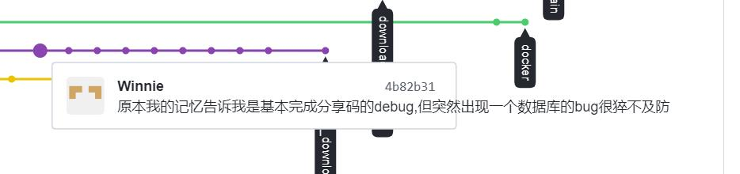
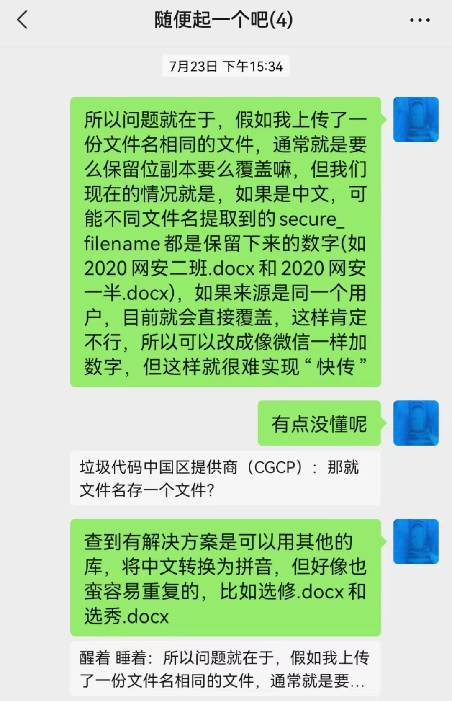

# 「创新实践能力团队赛」总结技术报告

####  写在前面

本次开发过程主要按照，项目要求，分为三个阶段依次展开，以下就以时间为线索展开说明

## 个人主要贡献

一句话概括：用户系统后端工作，与对称加密相关工作，杂项工作

个人报告没有添加实现的技术要点，如需查看请移步[这里](https://github.com/WhatEverTheNameIsCommunication/WhateverTheNameIs)，查看 Winnie-Lian 的开发过程、项目贡献及源代码 

### 技术功能实现

- 基于网页的用户注册与登录系统

    - 使用合法用户名和口令登录系统
      - > - 这里解释一下， 我们小组继承了「安靖-数字内容安全实践课程」 的分组情况
        > - 所以在此系统建立初期， 「 demo 」 中有残缺的登录框架等
        > - 但之前也是本人完成的相关内容，然后进行的再次开发

    - 禁止使用明文存储用户口令 【 PBKDF2 散列算法 慢速散列 针对列算法（如MD5、SHA1等）的攻击方法 】
      - 存储的口令即使被公开，也无法还原/解码出原始明文口令

- 基于网页的文件上传加密与数字签名系统

    - 对文件进行对称加密存储到文件系统，禁止明文存储文件 【 对称加密 密钥管理（如何安全存储对称加密密钥） 对称加密密文的PADDING问题 】
    - 文件秒传：服务器上已有的文件，客户端可以不必再重复上传了

- 基于网页的加密文件下载与解密
  - 提供匿名用户加密后文件的下载
  - 提供对已登录用户可使用「解密并下载功能」
  - 客户端对下载后的文件可以解密还原到原始文件 【 对称解密 密钥管理 】

### 非技术要点

- 分享功能中，学聪给出链接，我这边给出分享码、完成加解密工作，然后整合学聪的链接完成分享功能
- 删除、公开功能的 **一半** 吧
  
  >  相关内容学聪给出过一版，但因为当时系统整合后改动蛮大的，完全处于瘫痪状态，不太能用所以重写的来着

- 添加分享页面中「重要说明」的弹窗提醒
- 添加区分用户逻辑
- 优化呈现给用户的文件名（包括但不限于前端呈现和下载时）

- 打杂工作？
  
  - 整理前端内容，对接后端路由
  - 对接大家的工作，整合起来，修复对接中产生的bug
  - 分享功能中，学聪给出链接，我这边给出分享码、完成加解密工作，然后整合学聪的链接完成分享功能
  
## 一些印象深刻的部分
### bug

- 数据库相关的bug
  
  - 项目初期，在完成注册功能时
    - 写入数据库，当时给的是按照参数传递（因为在继承demo时，当时登录很简单，只有一个参数，这样写是没有问题的）
    - 本人默认他会自己按照传参顺序依次对应上，但并不会、、、
  
      - 正确的写法应当是完整为 `phrase=variable` ，即 `字段与参数完整对应`  ， 不能偷懒
      - 否则将会报错为 「数据库字段匹配不成功」 （ 大概意思就是这样，找不到记录的图文了:cold_sweat:）
  
    - 但是相关文档，即使是官方文档也没有这样细致的说明
    - 总体上，找不太到解决方案（因为google中的相关报错，提供的情景是真的 数据库字段并没有对应）
    - 最终的解决

      - 当时有一位19级的师哥来所在地游玩，在一些「中传重庆分传」聚会路上提了一句，强烈建议我按照成功的例子抄写一遍，完全不要省略
      - 然后各种一直试，一直撞 之下，解决的
       
    - 之所以印象十分深刻，就是因为 `自己的想当然` 和这样的问题基本 `无解`
     
      - 因为这样的问题基本不会有人踩，所以太 「小众」
      - 感觉面对这样的问题，基本上属于是自己的问题，没有一个 「正确」的解决办法
  
  - 在整合分享码的时候
   
    - 下图展示崩溃，崩溃表示记忆深刻:pray: 
    - 其实这个bug到现在，都不太确定是不是这样
    - 简述即为突然（私以为是突然出现的）崩溃，然后再次启动数据库会显示被锁
    - 解决方案：删库重建
  
      - 可能是个治标不治本的方法
      - 但同上一个bug，google的方案几乎没有想同情景，因为实在是太突然，且无法复现，不太能知道是哪里的问题
      - 在看了一些相关文档、解决方案后，个人理解为就是数据库对应不上的问题一类
      - 认为可能的原因是，我们真的写了蛮多 "try and except"， 当时的测试可能有其他bug导致系统崩溃，但以为 "try" 的机制，所以有的内容已经在数据库进行修改，所以开始冲突了，于是自动启动了 "lock" 进行保护

-  文件名的bug
  
   -  使用flask的 `secure_filename` ，不支持中文，会自动忽略中文，于是可能导致文件名重复，文件存储时直接被覆盖
   -  这个有一些解决方案（稍显复杂），但当时要紧的内容不太是这个，所以就没有尝试
   -  最终的解决方案，限制上传全英文文件名
   
      -  考虑到其实这样的情况比较常见，很多软件的安装路径一类的经常因为中文路径、中文文件夹导致出错
      -  所以，有一点影响用户体验，但不致命叭
  
- 在整合代码的过程中
  
  - 有一个小的bug到很后来才发现
  - 我的工作是把我写的内容和别人写的整合到一起，发现我们的命名习惯不太一样
  - 情况可以描述为
  
    - 我将需要分享的文件在 POST_FILE 的查询结果命名为了 share ； 而别人将 Share_File 中的查询结果命名为了 share ，显然 两个表单中的 id 并不相同， 于是导致了一系列的错位，但并不会崩溃报错
  
  - 于是在过了好多天之后，在我解决另一问题（解密时发现使用id找不到文件）时，才逐步仔细寻找，发现了这个bug

### 其他的部分

- 技术部分——密码学的对称密码

  - 对称密码加密，在之前真的从来没有考虑到过，在实际应用中，封装好的加解密模块，一定是不会让你在使用方法的时候，提供一大串实际的 「密钥」（就是真正与 message 做异或等操作时的）
  - 当时其实困惑了很久到底怎么实现，后续可以解密，单纯的钻进了一个牛角尖
   
    - 自己写的时候卡了很久的bug，其实后来和小组鸡同鸭讲了一下，再很久之后我才明白，人家说的是什么哈哈哈哈哈
     
  - 这个过程体验的感觉很奇妙 :point_down:
   
    - 仔细回想，可能在上学期学习密码学之前，在只学习了网络空间安全导论之后，我肯定不会有这样的疑问，因为我根本不知道具体是怎么实现的
    - 所以站在房子外面，我可以轻易的知道怎么进去，怎么出来，但进去拿着放大镜走了一圈以后，突然站在一个房间，连出房间都忘记了
  
- 第一次合作体验完成整个项目

  - 大家一起写代码
  
    - 好像我们对于 github 有一些神圣的敬畏，就还是更喜欢下载所有文件，然后再整合哈哈哈哈
    - 于是整合过程中，仔细看别人写的内容，还挺奇妙的
  
      - 有的会发现新大陆，我下辈子都想不到这个可以这样写
      - 有的就蛮难理解的、、、
      - 有的就，如上，会产生一些意想不到的 bug
 
    - 存在蛮多重复性的代码其实，没有封装进模块或者函数等，在整合时，往往也是直接复制粘贴，其实好像更科学的是我提出需要你的什么内容，你告诉我在哪里使用什么函数就可以返回，这样感觉科学一点？
  
  - 一个项目
  
    - 想象的是城堡，慢慢的就变成了古墓
      - 初期规划时，往往很多细节都没想到，于是之前的规划和后来可能完全不太一样
      - 比如数据库的字段就改过很多次
      - 这个度好像很难拿捏，前期不可能想的面面俱到，但地基没有打好，后面的房子就只能通过修修补补来改变承重保持平衡
  
    - 模块化的好处
  
      - 比如我在修改用户下载、前端呈现的文件名的时候，真的改吐了，就是项目框架越拉越大，但重复代码却变得越来越多
      - 真切的体会到了 「可维护性」 的重要
  
    - 体验感

      - 感觉周期还蛮长的，导致一直在想着这个事情
      - 理论上来说，应该是生活和开发这个项目共存，简单的来说就是提高效率，使劲干活儿使劲玩耍
      - 但是感觉我们从小就是这样单线程学习过来，一旦手上有这个项目很难学号的同时，安排其他内容
      - 另外，整一学期都是这样，感受不到完成的效率是高是低，有时候看个文档一天就过去了，有时候改一个bug试了很久又回到了原点，仿佛没有进展但好像工作上一整天也没有低效率，就很矛盾，写代码的时间总是流逝的很快、、、、