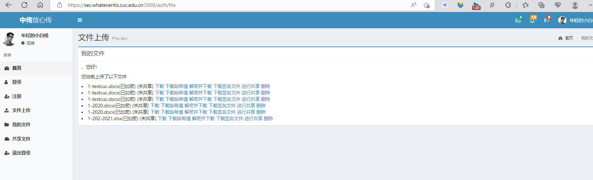
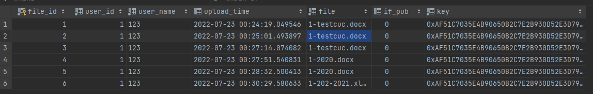
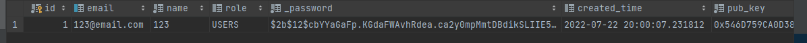

# 网站第一阶段使用指南

* 正常运行 `python main.py` 即可 ，如要初始化数据库请使用 `flask db init` 方法
* 注意：pass phrase 为 **passphrase**,请在自己的电脑hosts文件记录好 `127.0.0.1 sec.whateveritis.cuc.edu.cn`
    ```shell
    * Serving Flask app 'littleRedCUC.application' (lazy loading)
    * Environment: production
    WARNING: This is a development server. Do not use it in a production deployment.
    Use a production WSGI server instead.
   * Debug mode: on
    Enter PEM pass phrase:
   * Running on https://sec.whateveritis.cuc.edu.cn:5000 (Press CTRL+C to quit)
   * Restarting with stat
    111111
   * Debugger is active!
    ```
* 登录页面的 Email 指的是采用邮箱方式的双因素认证，Google 指的是采用二维码使用 google authentication app 扫码得到验证码（还未实现）
* 因为要双因素认证所以请保证你要登入的账号的**邮箱地址真实**！,如果允许时觉得麻烦可以将代码稍微修改注释。
* 如果只是单纯测试注册用户功能是否有效则邮箱地址不必真实。


# 第二阶段整合完毕（暂时
- 为测试登录方便，已注释掉双因素认证，如需验证，可找到`view.auth.login`修改注释代码块
- 进度
  - [x] 基本登录上传
  - [x] 文件加密
  - [x] 系统公私钥对
  - [x] 文件名中文问题暂未解决
    - [x] 如何命名能保证查找问题（限制英文or？
    - [x] 文件名重复问题（目前没有限制机制，直接覆盖？追加数字
    - [x] 重复文件上传问题（检测文件名直接无需上传？对比内容
  - [x] 美观性有提高空间
    - [x] 表格可以好看一点？【这里是本来已经做了，但本次整合尚未添加！！！】
    - [x] 显示描述文本
  - [x] 代码如废墟，需要重新优化一下
- 
- 
- 


# 第三阶段整合进度
* 修改 x.509 文件夹,启动无需 passphrase
*  instance 文件夹里有 download 子文件夹(存放供用户下载的文件),shared 子文件夹(存放由分享码加密的文件),system 子文件夹(系统文件),upload 子文件夹(用户上传的文件),temp(存放原始解密文件,定时删除)
* 实现了上传者可以下载各类文件(原始文件,解密文件写好后,我再放入我的路由里)
* html页面前端和后端已正常连接
* 需要在形成 Share_File 表时将分享码加密的文件存在shared子文件夹,这样我可以直接计算hmac,存入表里
* 由于分享码认证和生成还未实现所以还未验证匿名用户/已登录用户能否正常下载文件
 
  ---

**进度更新如下**
- 上传者自行管理文件部分
  - [x] 下载加密文件
  - [x] 解密并下载
  - [x] 下载加密文件hash
  - [x] 下载原始文件hahs
  - [x] 下载签名文件
  - [x] 文件共享
    - [x] 设置时间 
    - [x] 设置下载次数
    - [x] 取消共享
  - [x] 删除（由于基本不能用，于是重写
- 被分享者（THE_ONE)
  - [x] 下载加密文件
  - [x] 下载加密文件hash
  - [x] 解密并下载
  - [x] 下载原始文件hash
  - [x] 下载签名文件
- 客户端
  - [x] 解密
  - [x] 验证数字签名 **（但是验证错误！！！**
> 两个视频录制是目前实现功能的录屏
- 还存在的问题
  - [x] 删除尚未合并
  - [x] 数字签名没有验证成功
  - [ ] 客户端渲染有点问题（想把图片设置为背景来着，再议吧
  - [x] 前端有个更好看的表格没有添加进来
  - [x] 共享部分没有完成
  - [x] 部分文件名可以更细化（hash那块user_id好像没有去
  - [ ] 分享码目前不可读且太长
  - [ ] 数据库不定时有个奇怪报错 *cryptography.invalidtag* 
    - [x] （目前尚未找到根因，如出现的话可以删库重建先止一下血
      - 这个问题困扰巨久、、、搁置一下下，不然进度下不去了
      - 
  - [x] 公开分享
  - [x] 显示描述文本
  - [x] 各个看似正确但实际不正确的逻辑跳转应该都正确了（吧、、  
  - [ ] 优化代码
 
 > 个人认为我们的代码急需优化重构，维护起来真的很恼火、、、、、很多重复部分可以整合成模块比如弄成对称加密一样的class或者就单纯的函数也行叭，应该可以，只不过感觉也是个比较大的工程，毕竟现在拉的框架有点大了。但是debug修改真的...真的很容易改漏、、、就是一个bug越改越多的错误动作、、、、
